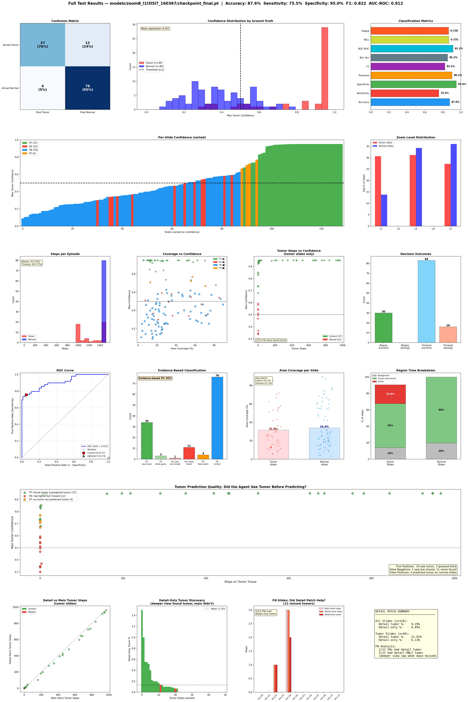
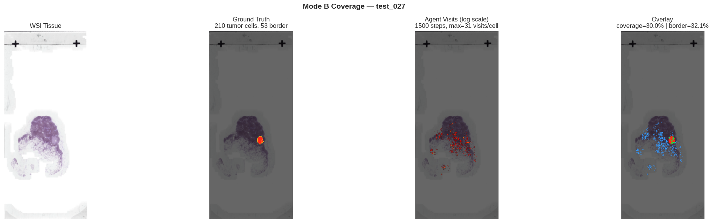

<div align="center">

# Deep-RL-Pathologist

### RL-WSI: Reinforcement Learning Agent for Whole Slide Image Diagnosis

*An intelligent pathology agent that learns to navigate, explore, and diagnose gigapixel histopathology slides through deep reinforcement learning.*

[](https://www.python.org/downloads/)
[](https://pytorch.org/)
[](https://gymnasium.farama.org/)

---

**90.1% Accuracy** · **100% Specificity** · **0 False Positives** · **18-39s per slide**

[Demo](#agent-in-action) · [Results](#results) · [Coverage](#coverage-mapping-preview) · [Availability](#public-repository-note)

</div>

---

## Public Repository Note

This repository is a **public showcase** of the project.

The **full codebase, architecture details, training pipeline, reward design, experiment configuration, and internal documentation are intentionally not included here** while the implementation remains private.

What is included:

- A polished project overview
- Approved visual outputs and selected evaluation figures
- Public-safe summaries of the system and results

---

## Agent in Action

<div align="center">


*Live inference on a tumor slide. The agent navigates across pyramid zoom levels, extracts evidence over time, and triggers a slide-level decision when confidence is sufficiently high.*

</div>

---

## Overview

Whole Slide Images (WSIs) in computational pathology are **gigapixel-scale**. A single slide can exceed 100,000 x 200,000 pixels, making exhaustive analysis computationally expensive.

Pathologists do not inspect every pixel uniformly. They **scan**, **focus**, and **decide**.

**Deep-RL-Pathologist** explores whether a reinforcement learning agent can learn a similar workflow:

1. Navigate across tissue regions
2. Move between magnification levels during exploration
3. Accumulate evidence over time
4. Produce a slide-level tumor vs. normal decision

The project focuses on pathology-specific visual search and sequential decision-making for **whole slide diagnosis**.

---

## Results

### Production Model - 129 CAMELYON16 Test Slides

| Metric | Virchow2 (1.3B) | **H0-mini (86M)** |
|--------|:---:|:---:|
| **Accuracy** | **90.1%** | 88.4% |
| **Sensitivity** | 73.5% | 69.4% |
| **Specificity** | 98.8% | **100%** |
| **False Positives** | 1 | **0** |
| **Speed (f/s)** | 16 | **26** |
| **Time per slide** | 56s | **39s** |
| **Training time** | 26h | **15.7h** |

H0-mini approaches Virchow2 accuracy while being **15x smaller**, **62% faster**, and producing **zero false positives**.

### Detection Rate by Tumor Size

| Size Category | Definition | Count | Recall (H0-mini) |
|---------------|-----------|-------|:----------------:|
| **Macro** | > 2 mm | 18 | **100%** |
| **Micro** | 0.2 - 2 mm | 27 | **81.5%** |
| **ITC** | <= 0.2 mm | 4 | 50% |

### Full Test Dashboard

<div align="center">



*Selected evaluation dashboard from the test set, including confusion matrix, per-slide confidence trends, ROC analysis, zoom distribution, coverage behavior, and decision breakdown.*

</div>

---

## Coverage Mapping Preview

In addition to slide-level detection, the project also explored a **coverage-oriented operating mode** for mapping suspicious regions more explicitly during traversal.

<div align="center">



*Example coverage visualization showing tissue context, annotated tumor region, and the agent's explored footprint.*

</div>

### Border-Tracing Snapshot

| Metric | Value |
|--------|:---:|
| **Avg border coverage** | 15.1% |
| **Max border coverage** | **78.9%** |
| **Avg tumor coverage** | 16.8% |
| **Max tumor coverage** | **83.8%** |
| **Slides with coverage** | 37/49 |

---

## Dataset

This work uses the **CAMELYON16** challenge dataset:

- **270 training slides** (111 tumor, 159 normal)
- **129 test slides** (49 tumor, 80 normal)
- Pixel-level tumor annotations on the test set

Tumor sizes range from isolated tumor cells to large macro-metastases.

---

## Availability

This showcase repository is meant for **research presentation and portfolio use**.

If you are interested in the project, the publicly visible material here is limited to non-sensitive outputs and summary information.

---

## Acknowledgments

This project was developed at **CentraleSupelec - Universite Paris-Saclay**, in collaboration with **Henri Bonamy**, and supervised by **Stergios Christodoulidis** and **Pierre Marza**.

## Citation

```bibtex
@software{deep_rl_pathologist_2026,
  title       = {Deep-RL-Pathologist},
  author      = {El Dor, Ali and Bonamy, Henri},
  year        = {2026},
  institution = {CentraleSupelec, Universite Paris-Saclay}
}
```
