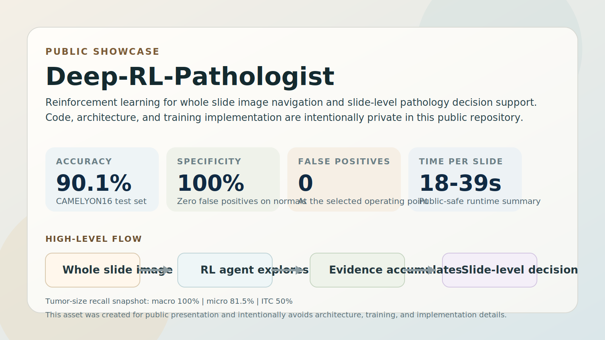

# Deep-RL-Pathologist

## Public Showcase Repository

This repository is a **public-facing snapshot** of the project for portfolio and LinkedIn use.

The full implementation, training pipeline, architecture details, reward design, and internal experiment code are intentionally **not included here**.

## Overview

**Deep-RL-Pathologist** explores how a reinforcement learning agent can navigate gigapixel whole slide images (WSIs) and support pathology diagnosis by learning where to look, when to zoom, and when to flag suspicious tissue.

Rather than exhaustively processing every pixel, the agent is designed around a pathologist-like workflow:

- Navigate across tissue regions
- Change magnification levels during exploration
- Aggregate evidence over time
- Produce a slide-level decision

## Headline Results

Evaluation on the **CAMELYON16** test set:

| Metric | Result |
| --- | ---: |
| Accuracy | **90.1%** |
| Specificity | **100%** |
| False Positives | **0** |
| Time per slide | **18-39s** |

Tumor-size sensitivity summary:

| Category | Recall |
| --- | ---: |
| Macro metastases | **100%** |
| Micro metastases | **81.5%** |
| ITC | **50%** |

## Selected Figure



*Public-safe summary graphic based on approved headline results. Internal dashboards, trajectory views, and training visualizations are intentionally omitted from this repository.*

## What Is Included Here

- A high-level project summary
- A selected results figure for public presentation
- Non-sensitive context suitable for sharing publicly

## What Is Intentionally Omitted

- Source code
- Model architecture details
- Training scripts and experiment configuration
- Internal documentation
- Full visual/debug outputs from development

## Dataset

This work uses the **CAMELYON16** challenge dataset of histopathology whole slide images for lymph node metastasis detection.

## Acknowledgments

Developed at **CentraleSupelec - Universite Paris-Saclay**, in collaboration with **Henri Bonamy**, and supervised by **Stergios Christodoulidis** and **Pierre Marza**.

## Citation

```bibtex
@software{deep_rl_pathologist_2026,
  title        = {Deep-RL-Pathologist},
  author       = {El Dor, Ali and Bonamy, Henri},
  year         = {2026},
  institution  = {CentraleSupelec, Universite Paris-Saclay}
}
```
